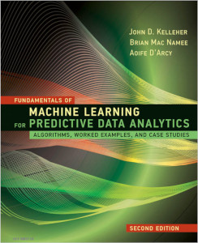
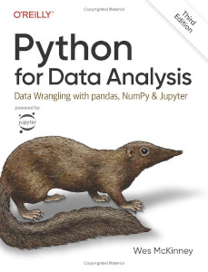

# Data Science Programming

This material has been developed for the course IFI 8410 in the [Master of Science in Analytics](https://robinson.gsu.edu/program/data-science-and-analytics-ms/)
 at the [J. Mack Robinson College of Business](http://robinson.gsu.edu) at [Georgia State University](http://gsu.edu).

## Topics and Schedule
The schedule below applies to Spring 2024. Please, refer to this page for any changes.

| Session | Date              | Topics                                                                 | Reading                             | Quiz/Exam                  |
|---------|-------------------|------------------------------------------------------------------------|-------------------------------------|----------------------------|
| 1       | August 28, 2024   | UNIX file system, command line tools, Jupyter notebook | | -/- |
| 2       | September 4, 2024 | Python Programming | Py #2 | Quiz 1|
| 3       | September 11, 2024| Python Data Structures and Functions, File-IO; Intro ML | Py #3; ML #1 | Quiz 2|
| 4       | September 18, 2024| Arrays, Vectors, Matrices, Linear Algebra in Python; Data to Insights to Decisions | Py #4; ML #2 | Quiz 3 |
| 5       | September 25, 2024| Data Tables (Pandas, etc.); Data Exploration | Py #5; ML #3.1-5 | Quiz 4|
| 6       | October 2, 2024   | Data Transformation and Visualization | Py #7 + #9                          | Quiz 5|
| 7       | October 9, 2024   | String and Text, Regexp, Beautiful Soup | [online](#) | Quiz 6|
| 8       | October 16, 2024  | | | **Midterm Exam**              |
| 9       | October 23, 2024  | Python libraries for statistics and ML; Information-based Learning, Similarity-based Learning | Py #12; ML #4.1-3, #5.1-3           | Quiz 7 |
| 10      | October 30, 2024  | Python Modules, classes, methods; Probability-based Learning, Error-based Learning | [online](#); ML #6.1-3, #7.1-3 | Quiz 8|
| 11      | November 6, 2024  | Algorithms; Evaluation of ML Models                                    | [online](#); ML #9            | Quiz 9|
| 12      | November 13, 2024 | Unsupervised Learning                                                  | ML #10 | Quiz 10 |
| 13      | November 20,2024 |  ML Usecases | ML #13 | Quiz 11 |
|         | November 27, 2024 | *Thanksgiving Break* | |                            |
| 14      | December 4, 2024  | ML Projects | | -/- |
|         | December 11, 2024 | | | **Final Exam** |

## Homework

|	Assignment	|	Date Posted	|	Due Date	|
|---------------|---------------|---------------|
|	[HW01](Homework/HW01)	| Wednesday, August 28, 2024 | Wednesday, September 4, 2024 |
|	[HW02](Homework/HW02)	| Wednesday, September 4, 2024 | Wednesday, September 11, 2024 |
|	[HW03](Homework/HW03)	| Wednesday, September 11, 2024 | Wednesday, September 18, 2024 |
|	[HW04](Homework/HW04)	| Wednesday, September 18, 2024 | Wednesday, September 25, 2024 |
|	[HW05](Homework/HW05)	| Wednesday, September 25, 2024 | Wednesday, October 2, 2024 |
|	[HW06](Homework/HW06)	| Wednesday, October 2, 2024 | Wednesday, October 9, 2024 |
|	[HW07](Homework/HW07)	| Wednesday, October 9, 2024 | Wednesday, October 23, 2024 |
|	[HW08](Homework/HW08)	| Wednesday, October 23, 2024 | Wednesday, October 30, 2024 |
|	[HW09](Homework/HW09)	| Wednesday, October 30, 2024 | Wednesday, November 6, 2024 |
|	[HW10](Homework/HW10)	| Wednesday, November 6, 2024 | Wednesday, November 13, 2024 |

## Text Books

1. **Fundamentals of Machine Learning for Predictive Data Analytics, 2nd Edition**
    by John D. Kelleher, Brian Mac Namee, and Aoife D’Arcy
    [MIT-Press](https://mitpress.mit.edu/9780262044691/fundamentals-of-machine-learning-for-predictive-data-analytics/)
2. **Python for Data Analysis: Data Wrangling with pandas, NumPy, and Jupyter, 3rd Edition**
    by Wes McKinney [online](https://wesmckinney.com/book/)

